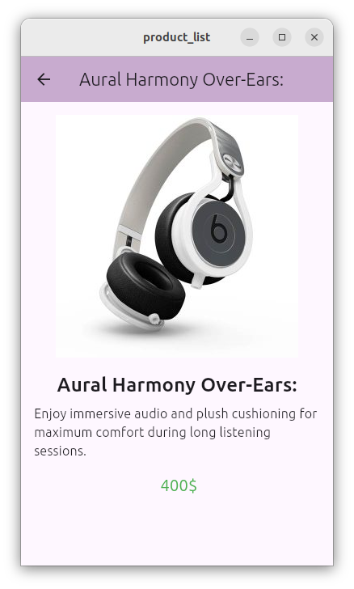

Flutter Product List App

Welcome to the Flutter Product List App! This application showcases a list of products where users can click on an item to view its image and details.
Features

    Display a list of products
    Navigate to a detailed view of each product
    Responsive design using Flutter

Output

Getting Started
Prerequisites

    Flutter installed on your machine
    Dart SDK

Installation

    Clone the repository:

    bash

git clone https://github.com/CH-Umar-Aslam/Android-Development/tree/Assignment2

Navigate to the project directory:

bash

cd Assignment2

Install dependencies:

bash

flutter pub get

Run the app:

bash

    flutter run

How to Use

    Open the app to see the list of products.
    Click on any product to view more details, including an image.

Acknowledgments

    Thank you to my instructor for their guidance throughout this project.
    Special thanks to the Flutter community for their resources and support.

Contact

For any questions or feedback, feel free to reach out to me at chumaraslam22@gmail.com.
Additional Notes

    Email Address: Don’t forget to replace [your-email@example.com] with your actual email address.

    Asset Declaration: Make sure your assets are declared in pubspec.yaml:

    yaml

    flutter:
      assets:
        - assets/img.png
        - assets/img_1.png
        - assets/img_2.png
        - assets/img_3.png

 
